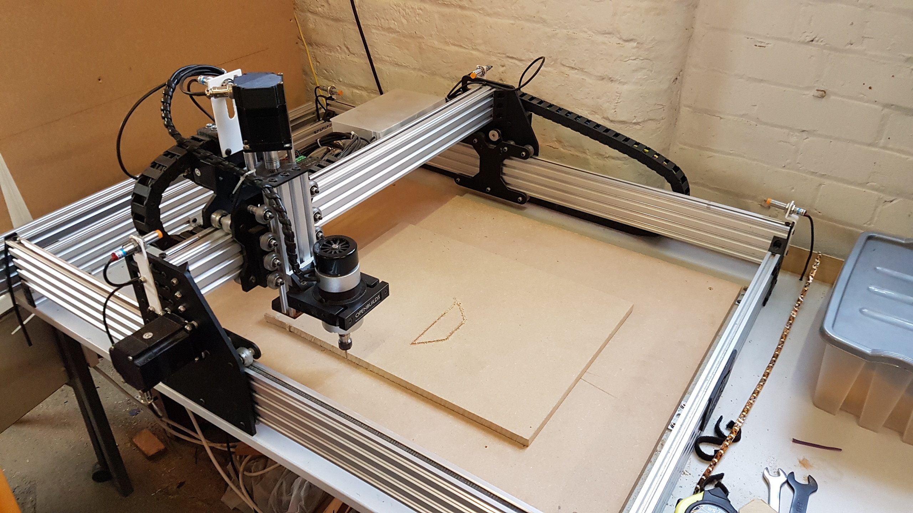
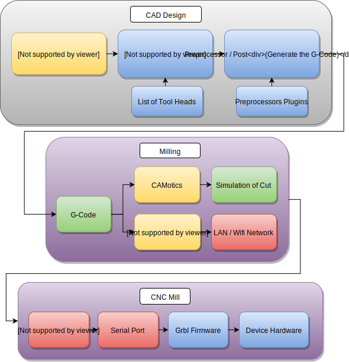

# Hacman - Ox CNC

## Overview

This is a series of docs for the use of the Ox CNC within the Hackspace.  
This was originally run as part of a pledge run: <http://wiki.hacman.org.uk/Pledges/OxCNCIan>  
(Many thanks to Ian for all the additional bits)

The docs are largley split into 3 sections

  * **CAD / CAM** - First use the CAD / CAM Software to create the G-Code
  * **Milling** - once you have the G-Code to run on the mill use this section to carry out the milling
  * **Maintenance** - Note for future upgrates etc

  

## WorkFlow

  * You design your part in Cad software or as a vector diagram / inkscape etc
  * You pass the design into CAM software which plots out the paths needed to mill the part (similar to a 3D Printer slicer)
  * You run the generated G-Code on the mill (usually via chillipepr)

With a 3d Printer generally it's a lot simpler, but with a CNC you instead have to decide which tools to use, which areas to mill etc.
The software automates a lot of it, but there's a lot of different ways to mill a part which can make the process a little more complex
depending on what it is your trying to do.

The post processor is usually a part of the Cam software that generates G-Code for specific types of CNC.  
This could include one processor for Grbl, another for TinyG. The one we're interested in is Grbl 1.1  
Generally if there's a post processor for LinuxCNC then this should also work with Grbl.

## Software

### Open Source Software

  * **[JSCut](http://jscut.org/)** - Easiest to use Open source Cam software, limited to 2.5 CAM / 2 dimensional profiles similar to a laser cutter
  * **[FlatCAM](http://flatcam.org/)** - PCB Milling via G-Code, this is one of the few PCB to G-Code softwares that has a GUI.
  * **[PyCAM](http://wiki.linuxcnc.org/cgi-bin/wiki.pl?Cam)** - Can handle STL Files and generate 3D Cam profiles, but seems not to be updated often
  * **[FreeCad](http://www.freecadweb.org/wiki/index.php?title=Path_Workbench)** - Path workspace, this is the closest match to Solidworks in the open source world and has support for importing openscad files
  * **[HeeksCad / HeeksCNC](https://github.com/Heeks/heekscad)**

### Free / Non open source software

  * **[Autodesk Fusion 360 CAM / Cad](http://cam.autodesk.com/fusion360/)**

### Commercial Software

Generally CAM software falls into two catagories one for solid parts such as gears / wheels etc, this includes HsmWorks and MasterCAM.
The second for graphical artworks such as fancy reliefs like dragons or lettering or Han solo in carbonite. 

  * **[HsmWorks / Solidworks](http://www.hsmworks.com/)** - Milling Solid 3D parts
  * **[MasterCam / Solidworks](http://www.mastercam.com/en-us/Solutions/Integrated-CAD-Solutions/Mastercam-for-SOLIDWORKS)** - Milling Solid 3D parts
  * **[Aspire](http://www.vectric.com/cool-stuff/projects/2013/bread-box.html)** - Milling graphical / artwork type patterns such as lettering or meshes.
  * **[Autodesk ArtCam](https://www.autodesk.com/products/artcam/overview)** - Milling graphical / artwork type patterns such as lettering or meshes.

If your using Solidworks then the top two items of commercial CAM software includes Hsmworks and MasterCam.  
Hsmworks is by far the easiest to use, but not to good at turning or 4 / 5 Axis.  
MasterCam has the most features but is much more difficult to use.  
